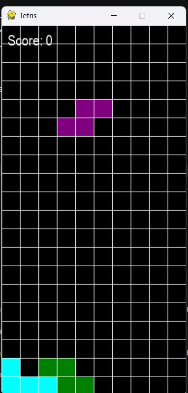

## Preview



# 🎮 Tetris Game (Python, Pygame)

A simple Tetris game built using Python and Pygame.

## Features
- Falling blocks
- Collision detection
- Row clearing
- Score system
- Game over screen
- Restart functionality

## Technologies
- Python
- Pygame

## Controls
- ← → move
- ↓ faster drop
- ↑ rotate
- R restart
- Q quit

## How to run

```bash
pip install pygame
python main_tetris.py

## Author

Lisa — Python & AI student, currently learning backend and DevOps.
